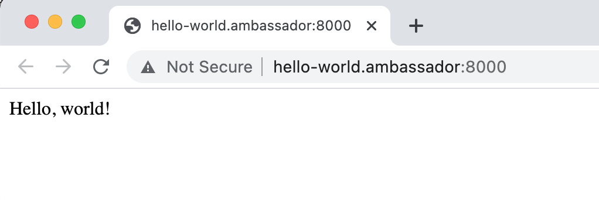

## Installing Telepresence(macOS)

```bash
# installing telepresence
brew install datawire/blackbird/telepresence
```

## Upgrade Process(macOs)

```bash
# Upgrade via brew
brew upgrade datawire/blackbird/telepresence
```

## Quick example

telepresence 默认会使用当前的 kubectl 的 current context 来进行请求。

### 1. 在 Kubernetes 集群运行一个 hello-world 服务

```bash
kubectl run hello-world \
--image=datawire/hello-world \
--port=8000 \
--expose
```

### 2. 在本地启动 Telepresence，建立到集群的连接

```bash
# 将本地环境连接到远程 kubernetes 集群
➜ telepresence connect
Launching Telepresence Root Daemon
Launching Telepresence User Daemon
Connected to context development-private@xdp-bee (https://<clusterip>:6443)
```

### 3. 查看连接状态

```bash
➜ telepresence status
Root Daemon: Running
  Version   : v2.4.3 (api 3)
  DNS       :
    Remote IP       : 10.96.0.10
    Exclude suffixes: [.arpa .com .io .net .org .ru]
    Include suffixes: []
    Timeout         : 4s
  Also Proxy: (0 subnets)
User Daemon: Running
  Version           : v2.4.3 (api 3)
  Ambassador Cloud  : Login expired (or otherwise no-longer-operational)
  Status            : Connected
  Kubernetes server : https://<clusterip>:6443
  Kubernetes context: development-private@xdp-bee
  Telepresence proxy: ON (networking to the cluster is enabled)
  Intercepts        : 0 total
```

### 4. 验证直接连接 hello-world 服务

```bash
➜ curl http://hello-world.ambassador:8000/
Hello, world!
```

再用浏览器访问该域名，仍然起作用，说明 telepresence 其实影响了整个机器环境。




[Telepresence v2](https://www.telepresence.io/) 通过 Kubernetes service 的 `服务名称` + `命名空间` + `端口` 访问服务，相比 [Telepresence v1](https://www.telepresence.io/docs/v1/discussion/overview/)，需要额外加上 `namespace`

### 5. 退出守护进程

```bash
➜ ps -ef|grep -i telepre
    0 12800     1   0 10:57PM ttys004    0:00.02 sudo --non-interactive --preserve-env /usr/local/bin/telepresence daemon-foreground /Users/linqiong/Library/Logs/telepresence /Users/linqiong/Library/Application Support/telepresence
    0 12801 12800   0 10:57PM ttys004    0:00.52 /usr/local/bin/telepresence daemon-foreground /Users/linqiong/Library/Logs/telepresence /Users/linqiong/Library/Application Support/telepresence
  501 12805     1   0 10:57PM ttys004    0:03.09 /usr/local/bin/telepresence connector-foreground
```

```bash
➜ telepresence quit
Telepresence Root Daemon quitting... done
Telepresence User Daemon is already stopped
```

```bash
➜ ps -ef|grep -i telepre
  501 35252 28508   0 11:19PM ttys004    0:00.00 grep --color=auto --exclude-dir=.bzr --exclude-dir=CVS --exclude-dir=.git --exclude-dir=.hg --exclude-dir=.svn --exclude-dir=.idea --exclude-dir=.tox -i telepre
(base)
```

此时再去访问 `hello-world` 会失败，因为流量不再从本地环境代理。