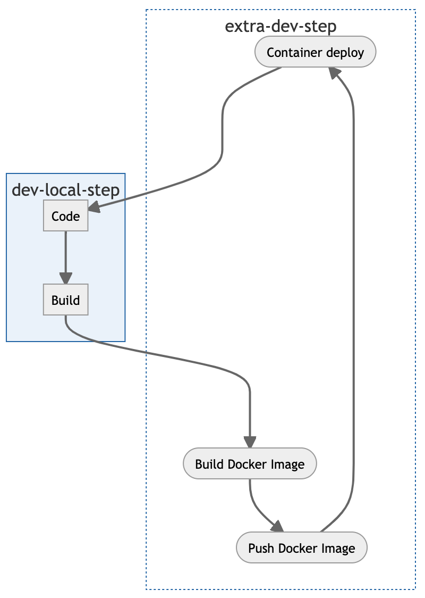

# Overview

XDP 平台已经全面微服务化，且完全拥抱 Kubernetes，通过 Kubernetes 完成日常的开发，测试以及生产发布。

虽然 Kubernetes 解决了微服务运行时的环境问题，但是对于开发者来说，在微服务开发过程中就不是那么的友好了，而且在本地开发的效率也不是那么的理想，甚至可以说是很痛苦。


## 微服务开发痛点

众所周知微服务架构很难，不好搞，这里不进行深入微服务架构的痛点，只说开发者在微服务开发过程中碰到的微服务架构下的开发环境问题。

现在 XDP 平台具不完全统计已经有几十个服务了，这还是在不包括基础设施服务的前提下。假如你作为 XDP 团队的一个新人，接到一个需求，在某个服务下增加一个功能或者是要修复一个 bug，你接下来准备怎么做？

打算将几十个服务都在本机跑起来吗？且不说你不知道 XDP 平台到底有多少个服务，光是想想配置这一整套环境都头大，再说你的机器是否有足够的资源能撑的起 XDP 平台的运行。

## 开发现状

### local + remote

利用 Kubernetes 原生的特性 port-forward 命令或者 [kubefwd](https://github.com/txn2/kubefwd) 工具，将 Kubernetes 集群中的服务转发到本地，然后通过 local 的方式访问 Kubernetes 集群中的服务，这种方式可以解决开发过程中的一些联调问题。

**痛点**

1. 需要转发的服务配置不可控，且取决于团队成员是否都有 Kubernetes 基础，是否对平台的微服务架构都比较了解。
2. 不稳定，时不时需要重新做服务映射，特别是在家里用 VPN 连入公司内网情况下
3. 单向调用，只能从本地向集群发请求，集群内的流量请求无法劫持转发到本地

### remote

利用内网自动化流水线的的方式，将代码发布到内网测试环境，即将服务持续的部署到内网 Kubernetes 测试环境中进行联调测试，以便提前发现问题。

**痛点**

1. 虽然该过程可以自动完成，但是每次调试至少需要经历以下步骤（git commit -> docker build -> deploy to k8s cluster），耗时比较长，效率低下。
2. 一般每个团队都是共享内网开发测试环境的，这种 remote debug 方式会影响到团队内的其他成员的开发进度。

### pure offline

不建议你这么做，首先你需要利用比如 docker-comose 编排工具或者是 [Kind](https://github.com/kubernetes-sigs/kind) 在本地部署好环境，且不说你本地开发机器有没那么大的资源，同时维护两套部署配置也是一个挺费劲的事。

## Telepresence

那么有没有什么工具可以解决以上提的这些问题呢，它就是 [Telepresence](https://www.telepresence.io/)。 [Telepresence](https://www.telepresence.io/) 对基于 `Kubernetes` 的开发者来说是种非常强大的调试工具，甚至可以称之为调试利器。

[Telepresence](https://www.telepresence.io/) 现在默认使用 v2.x.x 版本安装，`v2` 官方用 `Golang` 做了重写，不论是实现方式和使用方式改变都是蛮大的，但是体验上比 [v1](https://github.com/lqshow/telepresence-labs/tree/telepresence_v1) 方便很多。

### Telepresence 解决的问题

1. [Telepresence](https://www.telepresence.io/) 是一个面向 `Kubernetes` 用户的开发测试环境治理的辅助工具，用于在本地轻松开发和调试服务，同时将服务代理到远程  `Kubernetes` 集群，无需等待容器做 `build`/`push`/`deploy`。
2. 使用 [Telepresence](https://www.telepresence.io/) 开发者可以使用本地熟悉的 IDE 和调试工具运行一个服务，并提供对 `Configmap`、`Secrets` 和远程集群上运行的服务的完全访问，无缝与 `Kubernetes` 集群中的其他服务进行联调，让微服务本地开发不再难。
3. 它能够在不修改代码的情况下，让本地应用程序无感知接入到 `Kubernetes` 集群中，简单来说就是可直接使用集群内的 `PodIP`， `ClusterIP` 以及 `DNS` 域名来访问集群中的其他服务。
4. 因为 [Telepresence](https://www.telepresence.io/) 在 `Kubernetes` 集群中运行的 Pod 中部署了双向网络代理，所以不再是单向调用。简单来说，本地服务可以完全访问远程集群中的其他服务，同时远程集群中运行的服务也可以完全访问本地服务。

### 本地环境

在你开发机器上执行完以下命令后，你可以想象成你的本地环境就是 `Kubernetes` 集群中的一个 `Pod`，能够无感知接入到 `Kubernetes` 集群，[Telepresence](https://www.telepresence.io/) 让你的本地环境成为`集群中的一部分`成为可能。

```bash
telepresence connect
```


<details>
	<summary>mermaid code</summary>

```
graph TB

classDef runtime fill:#fff,stroke-dasharray: 2 2;
classDef apps color:#fff,fill:#fff
subgraph cluster[Kubernetes in cloud]
    subgraph one
    app1[k8s.Service] --- app2[k8s.Service] --- app3[k8s.Service]
    end

    subgraph laptop[Laptop]
    app[Your Service]
    end

    subgraph three
    app3-1[k8s.Service] --- app3-2[k8s.Service] --- app3-3[k8s.Service]
    end
end

class cluster,laptop runtime
class one,three apps
```

</details>

### 开发现状的改变



<details>
	<summary>mermaid code</summary>

```
flowchart TB
    classDef extra-step fill:#fff,stroke-dasharray: 2 2;
    subgraph dev-local-step
    Code --> code-build[Build]
    end

    subgraph extra-dev-step
    build([Build Docker Image]) --> push([Push Docker Image]) --> deploy([Container deploy])
    end

    code-build ---> build
    deploy ---> Code

    class extra-dev-step extra-step
```

</details>


<details>
	<summary>mermaid code</summary>

```
flowchart TB
    subgraph dev-local-step
    Code --> code-build[Build]
    end
```

</details>

## Tools

- [A cli that exposes your local resources to kubernetes](https://github.com/omrikiei/ktunnel)
- [kubefwd](https://github.com/txn2/kubefwd)
- [Manage and Integration with your Kubernetes dev environment more efficient.](https://github.com/alibaba/kt-connect)
- [The debugger for microservices](https://squash.solo.io/)
- [Easy and Repeatable Kubernetes Development](https://github.com/GoogleContainerTools/skaffold)
- [Event-based Scripting for Kubernetes.](https://github.com/brigadecore/brigade)


## References

- [Telepresence: fast, realistic local development for Kubernetes microservices](https://www.telepresence.io/)
- [telepresence tutorials](https://www.telepresence.io/tutorials/kubernetes)
- [Why your development workflow is so important for microservices](https://www.getambassador.io/resources/why-workflow/)
- [Locally developing Kubernetes services (without waiting for a deploy)](https://hackernoon.com/locally-developing-kubernetes-services-without-waiting-for-a-deploy-f63995de7b99)